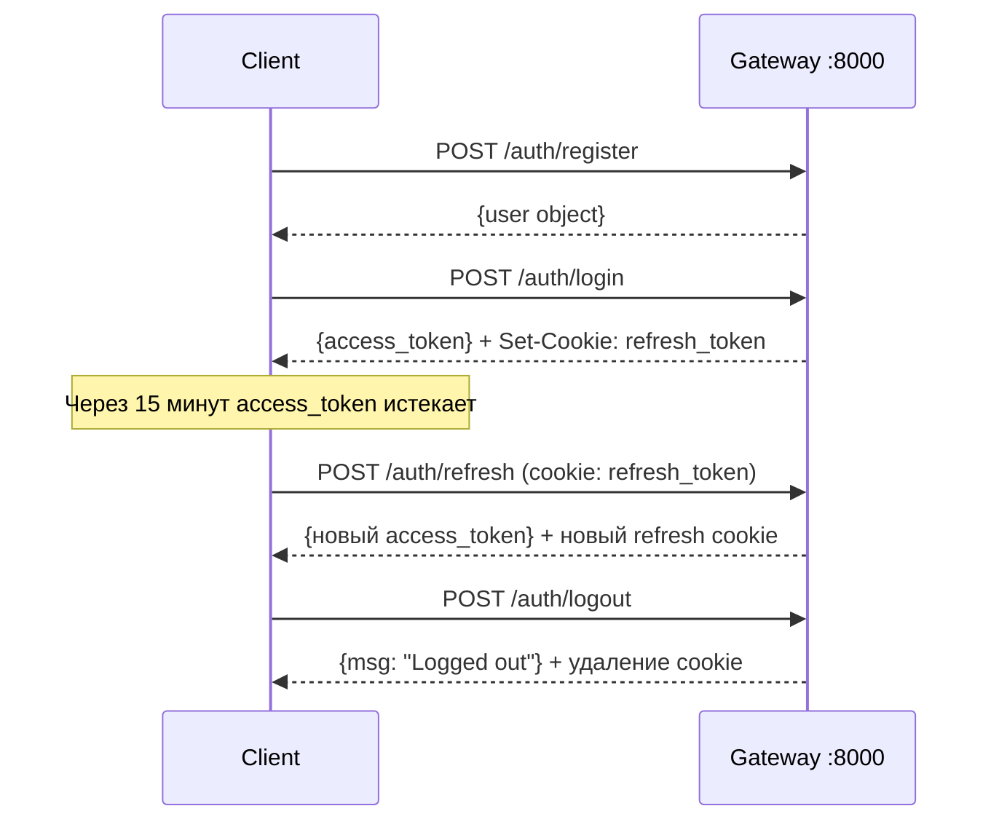

[Документация](../README.md) / [API](index.md) / Аутентификация

# API: Аутентификация

## Общий flow



---

## POST /auth/register

Регистрация нового пользователя.

**Тело запроса:**
```json
{
  "email": "user@example.com",
  "password": "StrongPass1!",
  "first_name": "Иван",
  "last_name": "Иванов",
  "middle_name": "Иванович"
}
```

| Поле | Тип | Обязательно | Правила валидации |
|------|-----|-------------|-------------------|
| `email` | string | да | Валидный email, уникальный |
| `password` | string | да | 8–128 символов, содержит A-Z, a-z, 0-9, спецсимвол |
| `first_name` | string | да | 2–50 символов, не пустое |
| `last_name` | string | да | 2–50 символов, не пустое |
| `middle_name` | string | нет | 2–50 символов или `null` |

**Ответ 200:**
```json
{
  "email": "user@example.com",
  "first_name": "Иван",
  "last_name": "Иванов",
  "middle_name": "Иванович",
  "is_active": true,
  "created_at": "2024-01-15T10:30:00",
  "updated_at": null
}
```

**Ошибки:** `400` — email занят, `422` — ошибка валидации

---

## POST /auth/login

Аутентификация и получение токенов.

**Тело запроса:**
```json
{
  "email": "user@example.com",
  "password": "StrongPass1!"
}
```

**Ответ 200:**
```json
{
  "access_token": "eyJhbGciOiJIUzI1NiIsInR5cCI6IkpXVCJ9...",
  "token_type": "bearer"
}
```

**Cookie:** `Set-Cookie: refresh_token=eyJ...; Path=/; HttpOnly; SameSite=strict; Max-Age=604800`

**Ошибки:** `401` — неверный email или пароль, `400` — пользователь неактивен

---

## POST /auth/refresh

Получение нового access token с помощью refresh token.

**Требования:** cookie `refresh_token` в запросе.

**Ответ 200:**
```json
{
  "access_token": "eyJhbGciOiJIUzI1NiIsInR5cCI6IkpXVCJ9...",
  "token_type": "bearer"
}
```

**Cookie:** новый `refresh_token` (rotate — старый инвалидируется)

**Ошибки:** `401` — cookie отсутствует или refresh token невалиден/просрочен

---

## POST /auth/logout

Выход из системы.

**Ответ 200:**
```json
{"msg": "Logged out"}
```

**Cookie:** `refresh_token` удаляется (`Max-Age=0`)

---

## GET /auth/me

Получить данные текущего пользователя.

**Заголовок:** `Authorization: Bearer {access_token}`

**Ответ 200:**
```json
{
  "token": "eyJhbGciOiJIUzI1NiIsInR5cCI6IkpXVCJ9...",
  "user": {
    "email": "user@example.com",
    "first_name": "Иван",
    "last_name": "Иванов",
    "middle_name": "Иванович",
    "is_active": true,
    "created_at": "2024-01-15T10:30:00",
    "updated_at": null
  }
}
```

**Ошибки:** `401` — невалидный токен, `404` — пользователь не найден

---

## PUT /auth/me

Обновить профиль пользователя. Все поля опциональны.

**Заголовок:** `Authorization: Bearer {access_token}`

**Тело запроса** (все поля опциональны, но хотя бы одно обязательно):
```json
{
  "first_name": "Пётр",
  "last_name": "Петров",
  "middle_name": "Петрович"
}
```

Передайте `"middle_name": ""` для удаления отчества.

**Ответ 200:** объект пользователя (аналогично GET /auth/me → user)

**Ошибки:** `401` — невалидный токен, `422` — ошибка валидации

---

## JWT токены

| Параметр | Access Token | Refresh Token |
|----------|-------------|---------------|
| Алгоритм | HS256 | HS256 |
| Срок жизни | 15 минут | 7 дней |
| Где хранится | В памяти / переменной | HTTP-only cookie |
| Передача | `Authorization: Bearer` | Автоматически (cookie) |
| Ротация | При каждом логине | При каждом refresh |

**JTI-binding:** access token содержит `refresh_jti` — ID текущего refresh token. Это связывает пару токенов и позволяет отслеживать невалидные сессии.

---

## Связанные разделы

- [Users Service](../services/users-service.md)
- [API: Банковские счета](bank-accounts.md)
- [API: WebSocket](websocket.md)
