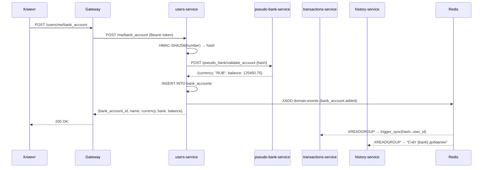

[Документация](../README.md) / [API](index.md) / Банковские счета

# API: Банковские счета

## Диаграмма добавления счёта



---

## POST /users/me/bank_account

Привязать банковский счёт к профилю пользователя.

**Заголовок:** `Authorization: Bearer {access_token}`

**Тело запроса:**
```json
{
  "bank_account_number": "40817810099910004312",
  "bank_account_name": "Моя карта",
  "bank": "Сбербанк"
}
```

| Поле | Тип | Описание |
|------|-----|----------|
| `bank_account_number` | string | Номер счёта (хэшируется перед сохранением) |
| `bank_account_name` | string | Отображаемое название |
| `bank` | string | Название банка |

**Ответ 200:**
```json
{
  "bank_account_id": 1,
  "bank_account_name": "Моя карта",
  "currency": "RUB",
  "bank": "Сбербанк",
  "balance": 125450.75
}
```

**Ошибки:**
- `400` — счёт уже привязан к другому пользователю
- `404` — счёт не найден в банке (pseudo-bank-service)
- `401` — невалидный токен

**После добавления:** автоматически запускается первичная синхронизация транзакций.

---

## GET /users/me/bank_accounts

Получить список всех привязанных счетов.

**Заголовок:** `Authorization: Bearer {access_token}`

**Ответ 200:**
```json
[
  {
    "bank_account_id": 1,
    "bank_account_name": "Моя карта",
    "currency": "RUB",
    "bank": "Сбербанк",
    "balance": 125450.75
  },
  {
    "bank_account_id": 2,
    "bank_account_name": "Накопительная",
    "currency": "RUB",
    "bank": "Альфа-Банк",
    "balance": 50000.00
  }
]
```

---

## PATCH /users/me/bank_account/{id}

Переименовать банковский счёт.

**Заголовок:** `Authorization: Bearer {access_token}`

**Тело запроса:**
```json
{
  "bank_account_name": "Основная карта"
}
```

**Ответ 200:** обновлённый объект счёта

**После переименования:** публикуется событие `bank_account.renamed` → transactions-service обновляет локальную копию.

---

## DELETE /users/me/bank_account/{id}

Отвязать банковский счёт.

**Заголовок:** `Authorization: Bearer {access_token}`

**Ответ 200:**
```json
{"detail": "Bank account deleted"}
```

**Примечание:** данные (транзакции в transactions-service) сохраняются. Счёт помечается как удалённый (`is_deleted=True` в transactions_db) и исключается из синхронизации.

---

## Связанные разделы

- [Users Service](../services/users-service.md)
- [Pseudo Bank Service](../services/pseudo-bank-service.md)
- [API: Синхронизация](sync.md)
- [API: Транзакции](transactions.md)
