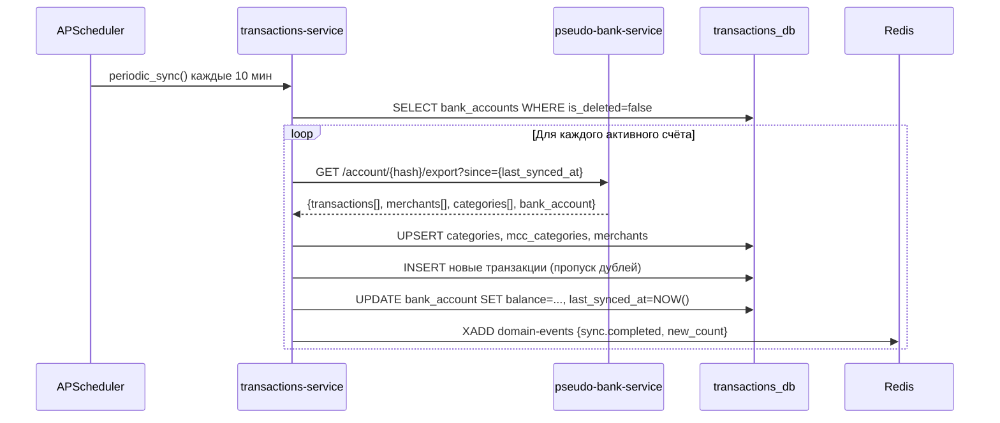

[Документация](../README.md) / [API](index.md) / Синхронизация

# API: Синхронизация

## Как работает синхронизация

SmartBudget не хранит транзакции в реальном времени — они периодически импортируются из псевдо-банка. Поддерживается три режима:

| Режим | Триггер | Частота |
|-------|---------|---------|
| Автоматическая (APScheduler) | Таймер | Каждые 10 минут |
| При добавлении счёта | Событие `bank_account.added` | Немедленно |
| Ручная (API) | Запрос клиента | По требованию |

---

## POST /sync

Ручная синхронизация всех банковских счетов текущего пользователя.

**Заголовок:** `Authorization: Bearer {access_token}`

**Ответ 200:**
```json
{"detail": "Sync started for all accounts"}
```

Синхронизация запускается асинхронно. Результат доступен:
- Через `GET /history/user/me` — запись "Синхронизация завершена"
- Через `WS /ws/history` — real-time уведомление

---

## POST /sync/{account_id}

Ручная синхронизация одного банковского счёта.

**Заголовок:** `Authorization: Bearer {access_token}`

**Ответ 200:**
```json
{"detail": "Sync started for account 1"}
```

---

## Диаграмма инкрементальной синхронизации



**Инкрементальность:** параметр `since` передаёт значение `last_synced_at` счёта. При первой синхронизации (новый счёт) `since=null` → экспортируется вся история.

---

## Связанные разделы

- [Transactions Service](../services/transactions-service.md)
- [API: Транзакции](transactions.md)
- [API: Банковские счета](bank-accounts.md)
- [Pseudo Bank Service](../services/pseudo-bank-service.md)
