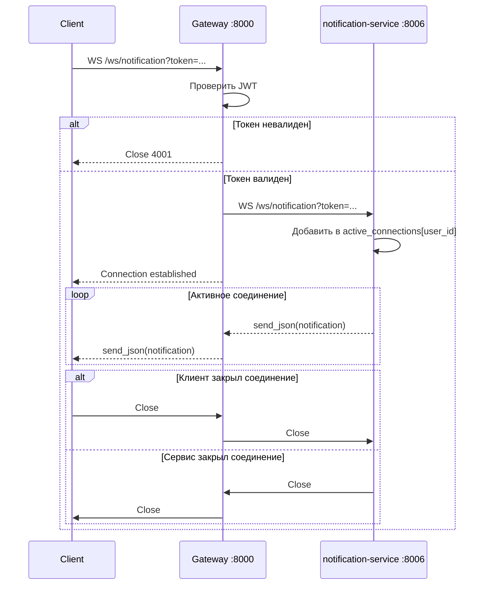

[Документация](../README.md) / [API](index.md) / WebSocket

# API: WebSocket

## Эндпоинты

| URL | Назначение |
|-----|-----------|
| `ws://localhost:8000/ws/notification?token={jwt}` | Real-time уведомления |
| `ws://localhost:8000/ws/history?token={jwt}` | Real-time история действий |

---

## Аутентификация

JWT access token передаётся как query-параметр `token`:
```
ws://localhost:8000/ws/notification?token=eyJhbGciOiJIUzI1NiIsInR5cCI6IkpXVCJ9...
```

При невалидном или просроченном токене соединение закрывается с кодом `4001`.

---

## Диаграмма WS прокси



Gateway проксирует сообщения двунаправленно через `asyncio.wait(FIRST_COMPLETED)`.

---

## Формат сообщений

### Уведомление (`/ws/notification`)
```json
{
  "id": "550e8400-e29b-41d4-a716-446655440000",
  "title": "Цель «Отпуск» — 80%!",
  "body": "Вы достигли 80% цели «Отпуск в Турции». Продолжайте!",
  "is_read": false,
  "created_at": "2024-01-20T15:30:00"
}
```

### Запись истории (`/ws/history`)
```json
{
  "id": "550e8400-e29b-41d4-a716-446655440001",
  "title": "Синхронизация завершена",
  "body": "Загружено новых транзакций: 47",
  "created_at": "2024-01-20T15:30:00"
}
```

---

## Коды закрытия

| Код | Причина |
|-----|---------|
| `1000` | Нормальное закрытие |
| `1011` | Ошибка проксирования (внутренняя ошибка сервера) |
| `4001` | Невалидный JWT токен |

---

## Пример JavaScript клиента

```javascript
const token = localStorage.getItem('access_token');
const ws = new WebSocket(`ws://localhost:8000/ws/notification?token=${token}`);

ws.onopen = () => {
  console.log('Подключено к уведомлениям');
};

ws.onmessage = (event) => {
  const notification = JSON.parse(event.data);
  console.log('Новое уведомление:', notification.title);
  // Обновить UI...
};

ws.onclose = (event) => {
  if (event.code === 4001) {
    // Токен просрочен, нужен рефреш
    refreshToken().then(() => reconnect());
  }
};
```

---

## Многопользовательские соединения

Один пользователь может иметь несколько активных WS-соединений одновременно (мобильное + веб). Каждое событие рассылается по всем активным соединениям пользователя.

```python
active_connections: dict[int, list[WebSocket]]
# {user_id: [ws1, ws2, ws3]}
```

---

## Связанные разделы

- [Notification Service](../services/notification-service.md)
- [History Service](../services/history-service.md)
- [API: Уведомления](notifications.md)
- [API: История](history.md)
