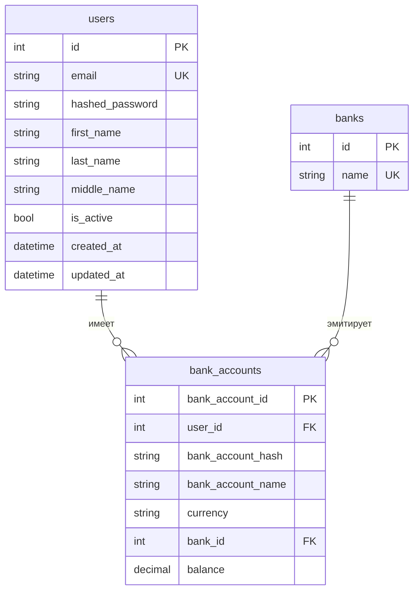
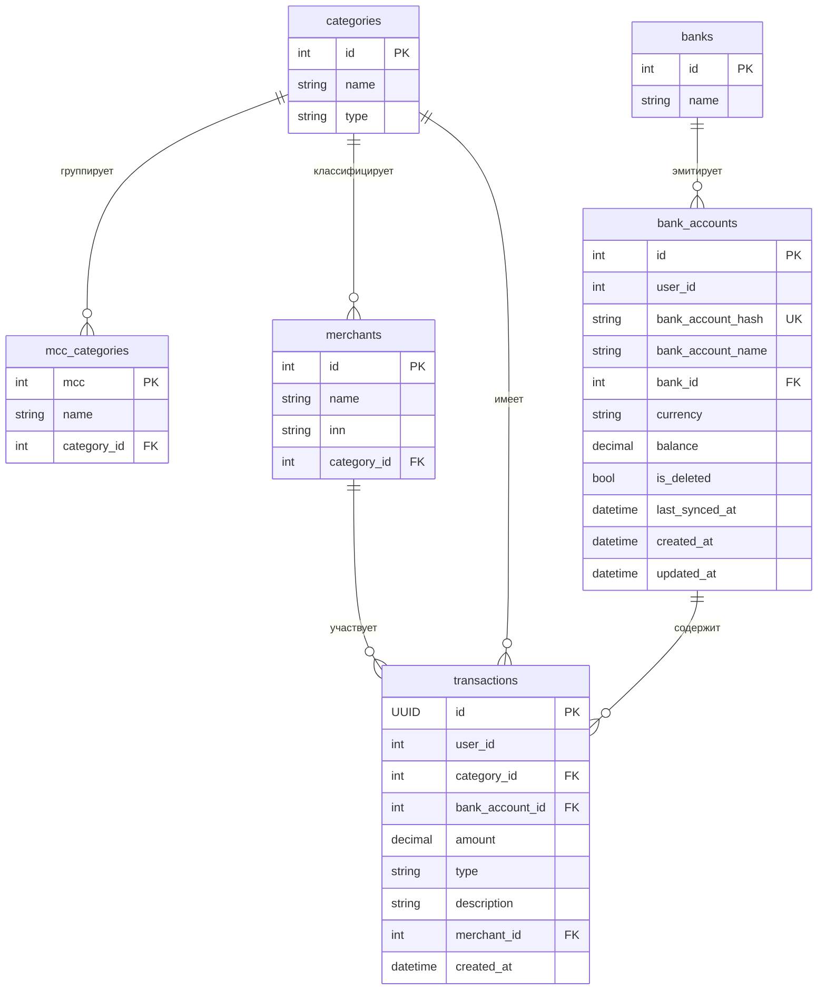

[Документация](../README.md) / [Архитектура](overview.md) / Модели данных

# Модели данных

## Принцип изоляции

Каждый сервис владеет своей схемой базы данных. Cross-service JOIN-запросы невозможны по архитектуре. Ссылочная целостность между сервисами обеспечивается через:
- `bank_account_hash` (HMAC-SHA256 от номера счёта) — общий идентификатор между users и transactions
- `user_id` (целое число) — передаётся в заголовке `X-User-ID`, не является FK в сервисах-потребителях
- Доменные события — синхронизация состояния (например, переименование счёта)

---

## users_db (PostgreSQL :5433)



**Хэширование счётов:** `bank_account_hash = HMAC-SHA256(account_number, key=BANK_SECRET_KEY)` — 64-символьная hex-строка. Реальный номер счёта нигде не хранится.

---

## transactions_db (PostgreSQL :5434)



**Приоритет категоризации:** `merchant.name` → `mcc_category` → категория по умолчанию.

`bank_account_hash` — связь с `users_db.bank_accounts`, но без FK constraint (разные БД).

---

## images_db (PostgreSQL :5435)

Единая универсальная таблица для всех типов изображений:

```
images
├── id            UUID PK
├── entity_type   VARCHAR  — "user_avatar" | "category" | "merchant"
├── entity_id     INT      — user_id, category_id или merchant_id (зависит от entity_type)
├── image_data    BYTEA    — бинарные данные изображения
├── content_type  VARCHAR  — "image/jpeg", "image/png", и т.д.
└── is_default    BOOL     — True для предустановленных изображений
```

**Логика аватарок:**
- `is_default=True, entity_type="user_avatar"` — предустановленные аватарки (общие для всех)
- `is_default=False, entity_type="user_avatar", entity_id=user_id` — выбранная аватарка пользователя

Уникальный индекс на `(entity_type, entity_id, is_default=False)` гарантирует одну активную аватарку на пользователя.

---

## purposes_db (PostgreSQL :5437)

```
purposes
├── id            UUID PK
├── user_id       INT     — ссылка на user (без FK, разные БД)
├── title         VARCHAR — название цели
├── deadline      DATETIME
├── total_amount  DECIMAL(12,2) — целевая сумма
├── amount        DECIMAL(12,2) — накоплено, default=0
├── created_at    DATETIME
└── updated_at    DATETIME
```

**Прогресс:** `progress = (amount / total_amount) * 100`

Уведомления публикуются при пересечении порогов: 25%, 50%, 80%, 100%.

---

## notification_db (PostgreSQL :5438)

```
notifications
├── id         UUID PK
├── user_id    INT
├── title      VARCHAR
├── body       TEXT
├── is_read    BOOL    — default=False
└── created_at DATETIME
```

---

## history_db (PostgreSQL :5439)

```
history_entries
├── id         UUID PK
├── user_id    INT
├── title      VARCHAR
├── body       TEXT
└── created_at DATETIME
```

---

## pseudo_bank_db (PostgreSQL :5436)

Зеркалирует структуру реального банковского API. Используется только для разработки и тестирования.

```
banks            — банки (Сбербанк, ВТБ, Альфа, ...)
bank_accounts    — тестовые счета (10 предзагруженных)
transactions     — история транзакций для каждого счёта
merchants        — мерчанты
categories       — категории транзакций
mcc_categories   — маппинг MCC-кодов на категории
```

---

## Redis — ключи и TTL

| Ключ | TTL | Сервис-источник | Описание |
|------|-----|-----------------|----------|
| `user:profile:{user_id}` | 300 сек | gateway | Профиль пользователя (GET /auth/me) |
| `bank_accounts:{user_id}` | 300 сек | users-service | Список банковских счетов |
| `purposes:{user_id}` | 30 сек | purposes-service | Финансовые цели пользователя |
| `images:default_avatars` | 6 часов | images-service | Список предустановленных аватарок |
| `images:categories_map` | 6 часов | images-service | Маппинг category_id → image_id |
| `images:merchants_map` | 6 часов | images-service | Маппинг merchant_id → image_id |
| `transactions:categories` | 12 часов | transactions-service | Справочник категорий транзакций |
| `domain-events` | — | все | Redis Stream (шина событий) |

**Стратегия Cache-Aside:** при чтении — проверяем кэш, при cache miss — читаем из БД и кладём в кэш. При записи — инвалидируем соответствующий ключ.

---

## Связанные разделы

- [Обзор архитектуры](overview.md)
- [Система событий](event-system.md)
- [Users Service](../services/users-service.md)
- [Transactions Service](../services/transactions-service.md)
