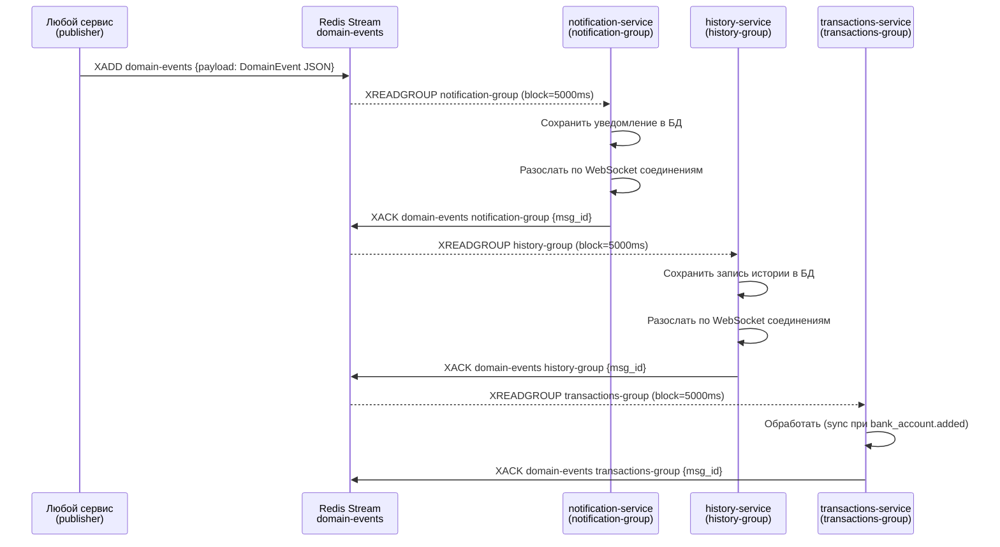
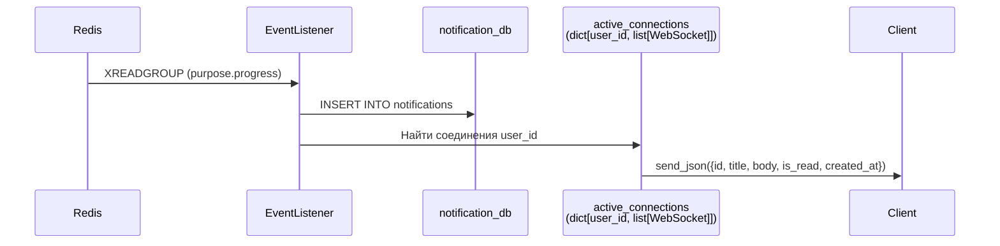

[Документация](../README.md) / [Архитектура](overview.md) / Система событий

# Система событий (Redis Streams)

## Назначение

Асинхронная шина событий развязывает сервисы при побочных эффектах. Когда бизнес-операция производит событие (добавление счёта, синхронизация, обновление цели), публикующий сервис не знает и не ждёт, кто его обработает.

**Паттерн:** один publisher → Redis Stream `domain-events` → несколько consumer groups.

---

## Схема потока



---

## Схема DomainEvent

```python
class DomainEvent(BaseModel):
    event_id:   UUID      # Уникальный ID события (uuid4)
    event_type: str       # Тип: "user.registered", "sync.completed", и т.д.
    source:     str       # Сервис-источник: "users-service", "purposes-service"
    timestamp:  datetime  # Время создания события (UTC)
    payload:    dict      # Произвольные данные события
```

Событие сериализуется в JSON и записывается в Redis Stream как одно поле `payload`.

---

## Каталог событий

| event_type | Источник | Слушатели | Payload |
|-----------|----------|-----------|---------|
| `user.registered` | users-service | notification-service | `{user_id, first_name}` |
| `user.updated` | users-service | history-service | `{user_id}` |
| `user.avatar.updated` | images-service | history-service | `{user_id}` |
| `bank_account.added` | users-service | transactions-service, history-service | `{user_id, bank_account_hash, bank_name}` |
| `bank_account.deleted` | users-service | history-service | `{user_id, bank_name}` |
| `bank_account.renamed` | users-service | transactions-service, history-service | `{bank_account_hash, new_name}` |
| `purpose.created` | purposes-service | history-service | `{user_id, name, target_amount, deadline}` |
| `purpose.updated` | purposes-service | history-service | `{user_id, name}` |
| `purpose.deleted` | purposes-service | history-service | `{user_id, name, target_amount}` |
| `purpose.progress` | purposes-service | notification-service | `{user_id, purpose_name, progress_percent, threshold}` |
| `transaction.category.updated` | transactions-service | history-service | `{user_id, old_category_name, new_category_name}` |
| `sync.completed` | transactions-service | history-service | `{user_id, new_transactions_count, synced_at}` |

---

## Consumer Groups

| Группа | Сервис | Имя консьюмера |
|--------|--------|----------------|
| `notification-group` | notification-service | `notification-service-consumer` |
| `history-group` | history-service | `history-service-consumer` |
| `transactions-group` | transactions-service | `transactions-service-consumer` |

Каждая группа независимо читает все события из стрима. Одно событие обрабатывается каждой группой ровно один раз (at-least-once delivery).

---

## EventPublisher

Класс `EventPublisher` из `shared/event_publisher.py` используется всеми сервисами-источниками.

**Инициализация** (один раз в `lifespan` сервиса):
```python
await EventPublisher.connect()  # создаёт общий пул соединений
# ...
await EventPublisher.close()    # при остановке
```

**Публикация события:**
```python
publisher = EventPublisher()
await publisher.publish(DomainEvent(
    event_id=uuid4(),
    event_type="bank_account.added",
    source="users-service",
    timestamp=datetime.utcnow(),
    payload={"user_id": 42, "bank_account_hash": "0eb1e1...", "bank_name": "Сбербанк"},
))
```

Если `connect()` не вызывался (например, в тестах), создаётся временное соединение автоматически (fallback).

---

## Механизм надёжности

**At-least-once delivery:**
- Консьюмер читает сообщения через `XREADGROUP` с `>` (только новые)
- После успешной обработки отправляет `XACK` — сообщение считается доставленным
- При ошибке обработки `XACK` не отправляется → сообщение остаётся в PEL (Pending Entry List)
- При переподключении консьюмер продолжит с того места, где остановился

**Reconnect loop:**
- При разрыве соединения: задержка 2 секунды, повторная попытка
- При повторной ошибке: задержка 5 секунд
- `mkstream=True` при создании группы — стрим создаётся автоматически если не существует

**Параллельность:**
- `block=5000` — блокирующее чтение с таймаутом 5 секунд
- Максимум 10 сообщений за одну итерацию (`count=10`)

---

## Доставка через WebSocket

После сохранения уведомления/записи истории в БД, сервис рассылает событие по активным WebSocket-соединениям:



Если пользователь не подключён по WS — уведомление сохраняется в БД и будет доступно при следующем открытии приложения через `GET /notifications/user/me`.

---

## Связанные разделы

- [Обзор архитектуры](overview.md)
- [Notification Service](../services/notification-service.md)
- [History Service](../services/history-service.md)
- [Transactions Service](../services/transactions-service.md)
