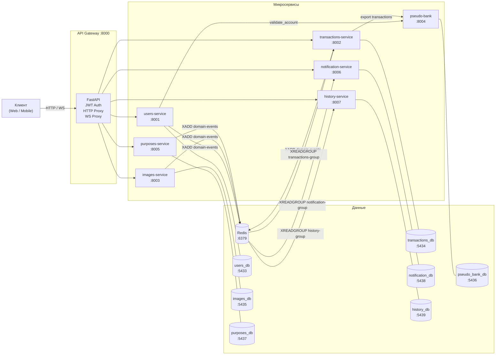

[Документация](../README.md) / Архитектура / Обзор

# Обзор архитектуры SmartBudget

## Принципы проектирования

SmartBudget построен на четырёх ключевых архитектурных принципах:

1. **Database-per-service** — каждый микросервис владеет своей изолированной базой данных. Прямые SQL-запросы между сервисами невозможны.
2. **Единая точка входа (API Gateway)** — все клиентские запросы проходят через Gateway, который выполняет JWT-аутентификацию и маршрутизирует трафик.
3. **Event-driven для побочных эффектов** — запись истории и отправка уведомлений выполняется через Redis Streams, а не синхронными вызовами.
4. **Cache-Aside через Redis** — часто читаемые данные (профиль, категории, аватарки) кэшируются в Redis с TTL.

---

## Компонентная диаграмма

---

## Слои системы

### 1. Транспортный слой
- **Gateway** принимает все клиентские HTTP-запросы и WebSocket-соединения
- Выполняет JWT-аутентификацию локально (без обращения к users-service)
- Проксирует запросы к нужному сервису через `httpx.AsyncClient`
- Передаёт `X-User-ID` заголовок вместо JWT в нижестоящие сервисы

### 2. Бизнес-слой (8 микросервисов)
Каждый сервис реализует одну бизнес-область и обладает полной автономией:
- собственная БД, собственные модели, собственная логика аутентификации запросов от Gateway

### 3. Слой данных
- **PostgreSQL ×8** — реляционное хранение данных (по одной БД на сервис)
- **Redis** — двойная роль: кэш (Cache-Aside) и шина событий (Streams)

### 4. Слой наблюдаемости
- **Prometheus** — сбор метрик FastAPI (latency, RPS, error rate)
- **Grafana** — дашборды для метрик и логов
- **Loki + Promtail** — агрегация логов из всех контейнеров

---

## Паттерны взаимодействия

### Синхронный (REST)
Клиент → Gateway → Сервис → ответ клиенту.

Используется для всех CRUD-операций, где результат нужен немедленно.

### Событийный (Redis Streams)
Сервис публикует `DomainEvent` в стрим `domain-events`. Потребители читают через `XREADGROUP` и обрабатывают независимо.

Используется для: уведомлений, истории действий, реакции на добавление банковского счёта.

### Прямой HTTP (service-to-service)
- `users-service` → `pseudo-bank-service` при добавлении счёта (валидация существования)
- `transactions-service` → `pseudo-bank-service` при синхронизации (экспорт транзакций)
- `gateway` → `users-service` при `GET /auth/me` (получение профиля)

### WebSocket (real-time)
Gateway проксирует WS-соединения к `notification-service` и `history-service`. Сервисы рассылают события по активным соединениям сразу после обработки Redis-события.

---

## Инфраструктурные компоненты

| Компонент | Версия | Роль | Порт |
|-----------|--------|------|------|
| Redis | 7 Alpine | Кэш (Cache-Aside) + шина событий (Streams) | 6379 |
| PostgreSQL | 13 | Реляционное хранилище (×8 изолированных БД) | 5433–5439 |
| Prometheus | latest | Сбор метрик FastAPI | 9090 |
| Grafana | latest | Дашборды метрик и логов | 3000 |
| Loki | latest | Агрегация логов | 3100 |
| Promtail | latest | Отправка Docker-логов в Loki | — |
| Redis Commander | latest | Web-UI для Redis | 8081 |

---

## Связанные разделы

- [Карта сервисов и маршрутизация](services-map.md)
- [Система событий Redis Streams](event-system.md)
- [Модели данных](data-model.md)
- [Быстрый старт](../deployment/quickstart.md)
