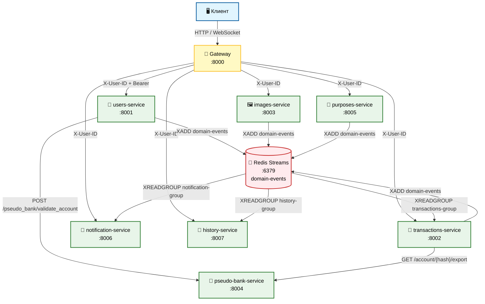

[Документация](../README.md) / [Архитектура](overview.md) / Карта сервисов

# Карта сервисов и маршрутизация

## Маршрутизация Gateway

Gateway принимает все запросы клиента на порт `8000` и проксирует их к нужному сервису по URL-префиксу:

| Префикс URL | Целевой сервис | Внутренний порт |
|-------------|----------------|-----------------|
| `/auth/` | users-service | 8001 |
| `/users/` | users-service | 8001 |
| `/transactions/` | transactions-service | 8002 |
| `/images/` | images-service | 8003 |
| `/purposes/` | purposes-service | 8005 |
| `/notifications/` | notification-service | 8006 |
| `/history/` | history-service | 8007 |
| `/sync` | transactions-service | 8002 |
| `/ws/notification` | notification-service | 8006 |
| `/ws/history` | history-service | 8007 |

---

## Полная диаграмма зависимостей

[Документация](../README.md) / [Архитектура](overview.md) / Карта сервисов

# Карта сервисов и маршрутизация

## Маршрутизация Gateway

Gateway принимает все запросы клиента на порт `8000` и проксирует их к нужному сервису по URL-префиксу:

| Префикс URL | Целевой сервис | Внутренний порт |
|-------------|----------------|-----------------|
| `/auth/` | users-service | 8001 |
| `/users/` | users-service | 8001 |
| `/transactions/` | transactions-service | 8002 |
| `/images/` | images-service | 8003 |
| `/purposes/` | purposes-service | 8005 |
| `/notifications/` | notification-service | 8006 |
| `/history/` | history-service | 8007 |
| `/sync` | transactions-service | 8002 |
| `/ws/notification` | notification-service | 8006 |
| `/ws/history` | history-service | 8007 |

---

## Полная диаграмма зависимостей


---

## Передача идентификатора пользователя

Клиент никогда не передаёт `user_id` напрямую — он извлекается из JWT в Gateway.

```
Клиент → Gateway:     Authorization: Bearer <JWT>
Gateway → Сервис:     X-User-ID: 42
Сервис:               читает заголовок X-User-ID, не проверяет JWT повторно
```

Единственное исключение — `users-service` при `PUT /auth/me`, куда Gateway пробрасывает исходный `Authorization` header для дополнительной верификации.

---

## Аутентификация в Gateway

### Лёгкая аутентификация (`get_current_user`)
Применяется на большинстве защищённых эндпоинтов.

1. Извлекает JWT из `Authorization: Bearer {token}` или query-параметра `?token=`
2. Декодирует локально с `ACCESS_SECRET_KEY`
3. Возвращает `{token, user_id, user: None}`
4. HTTP-вызов к `users-service` **не производится**

### Полная аутентификация (`get_current_user_with_profile`)
Применяется только на `GET /auth/me` и `PUT /auth/me`.

1. Выполняет лёгкую аутентификацию
2. Пытается получить профиль из Redis-кэша: ключ `user:profile:{user_id}` (TTL 300 сек)
3. При cache miss: HTTP GET `/users/me` к `users-service`
4. Кэширует ответ и возвращает `{token, user_id, user: {...}}`

---

## Прямые вызовы между сервисами

### users-service → pseudo-bank-service
При добавлении банковского счёта:
```
POST /pseudo_bank/validate_account
Body: {"bank_account_hash": "0eb1e101..."}
Response: {"currency": "RUB", "balance": 125450.75}
```
Если счёт не найден — возвращает 404, users-service отклоняет операцию.

### transactions-service → pseudo-bank-service
При синхронизации транзакций:
```
GET /pseudo_bank/account/{hash}/export?since={last_synced_at}
Response: {
  "bank_account": {...},
  "transactions": [...],
  "merchants": [...],
  "categories": [...]
}
```

### gateway → users-service
При полной аутентификации (с кэшированием):
```
GET /users/me
Authorization: Bearer {token}
```

---

## Порты сервисов

| Сервис | Внутренний порт | Внешний порт (prod) | Внешний порт (test) |
|--------|-----------------|---------------------|---------------------|
| gateway | 8000 | 8000 | 18000 |
| users-service | 8001 | 8001 | 18001 |
| transactions-service | 8002 | 8002 | 18002 |
| images-service | 8003 | 8003 | 18003 |
| pseudo-bank-service | 8004 | 8004 | 18004 |
| purposes-service | 8005 | 8005 | 18005 |
| notification-service | 8006 | 8006 | 18006 |
| history-service | 8007 | 8007 | 18007 |

---

## Связанные разделы

- [Обзор архитектуры](overview.md)
- [Система событий](event-system.md)
- [Gateway Service](../services/gateway.md)
- [API: Обзор](../api/index.md)
