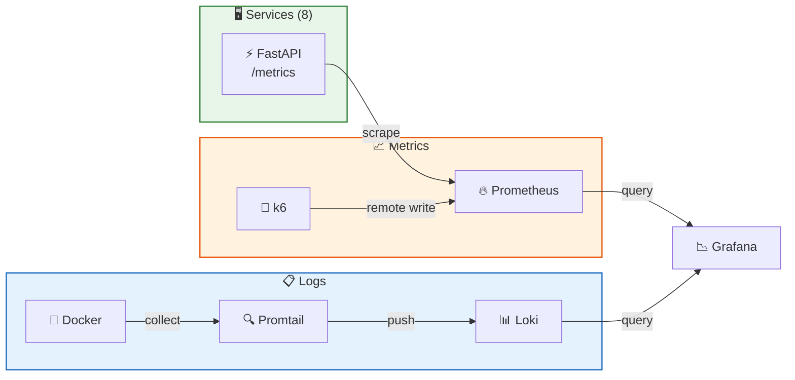

[Документация](../README.md) / Мониторинг / Обзор

# Мониторинг

## Стек мониторинга



---

## Адреса

| Сервис | URL | Доступ |
|--------|-----|--------|
| **Grafana** | http://localhost:3000 | admin / admin |
| **Prometheus** | http://localhost:9090 | — |
| **Loki** | http://localhost:3100 | только API |
| **Redis Commander** | http://localhost:8081 | — |
| **Grafana (test stack)** | http://localhost:13000 | admin / admin |
| **Prometheus (test stack)** | http://localhost:19090 | — |

---

## Prometheus

**Конфигурация:** `prometheus.yml` в корне репозитория.

Scrape targets — все 8 сервисов через `/metrics`:
```yaml
scrape_configs:
  - job_name: 'gateway'
    static_configs:
      - targets: ['gateway:8000']
  - job_name: 'users-service'
    static_configs:
      - targets: ['users-service:8001']
  # ... и т.д.
```

**Интервал:** 15 секунд.

**Автоматические метрики** (prometheus-fastapi-instrumentator):
- `http_request_duration_seconds` — гистограмма латентности
- `http_requests_total` — счётчик запросов по методу/пути/статусу
- `http_requests_in_progress` — в обработке

---

## Провизионирование Grafana

Datasources, дашборды и конфигурация управляются через файлы провизионирования — не требуют ручной настройки при старте.

| Файл | Назначение |
|------|-----------|
| `monitoring/datasources.yml` | Prometheus + Loki datasources |
| `monitoring/dashboards.yml` | Путь к дашбордам |
| `monitoring/service_metrics.json` | Метрики микросервисов |
| `monitoring/k6_dashboard.json` | Результаты нагрузочных тестов |
| `monitoring/logs-dashboard.json` | Логи из Loki |

Дашборды монтируются из хоста как read-only (`/var/lib/grafana/dashboards`).

---

## Связанные разделы

- [Grafana дашборды](grafana.md)
- [Логирование (Loki)](logs.md)
- [Нагрузочные тесты k6](../testing/load-testing.md)
